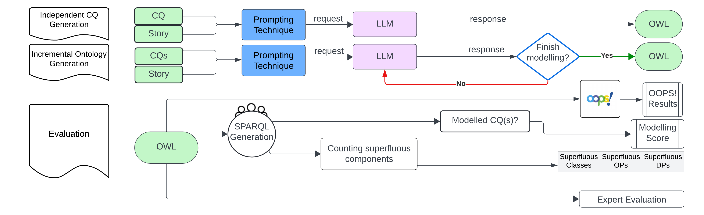

 
 <H1>Ontology Generation with LLMs</H1>

This repository contains supplementary materials for the submitted paper in ESWC 2025 - Research Track.  

This work improved ontology generation performance using two new prompting techniques. In this repository you can find details of the prompts, dataset for evaluation and some details that could not be fit in the page count : )

## Contents of the directory

|   | Title                                                      |                         Description                         |
|:-:|:-----------------------------------------------------------|:---------------------------------------------------------:|
| 1 | [Dataset for Ontology generation](/Dataset_OntoGen)          |   The dataset used in this work.                                  |
| 2 | [Experiment Results](/Experiment Results)  |           The results of the experiments for what concerns the evaluation.            |
|3 | [Generated OWLs](/Generated OWLs)       |             Generated OWL files for Ontogenia and MemlessCQbyCQ.              |
|4| [Prompting Techniques](/Prompting Techniques)|              The code to execute the two prompting techniques.              |
|5|  [Images](/Images)      |                     Images used for the README and the paper.   

## Prompting techniques
The prompting techniques used in this work can be found [here](/PromptingTechniques)

## Dataset
The dataset is publicly available for future ontology generation processes. To prevent LLMs from including this dataset in their training data, it is zipped and locked with a publicly available password.

password for zipped files: 28mRFhW6wVnu7Wh

## GPT-4 hyperparameters
Our work used GPT-4 API version 1106, with the model's hyperparameters (frequency\_penalty, presence\_penalty, and temperature) set to zero. In fact, these hyperparameters manage the model's output. The frequency\_penalty penalizes frequently seen words during training, while the presence\_penalty penalizes words present in the current context when generating the next token. High temperature forces the model to be creative. This is to make sure if a prefix/class/property is defined in the ontology, in the future, LLM can use it again and not penalized.
